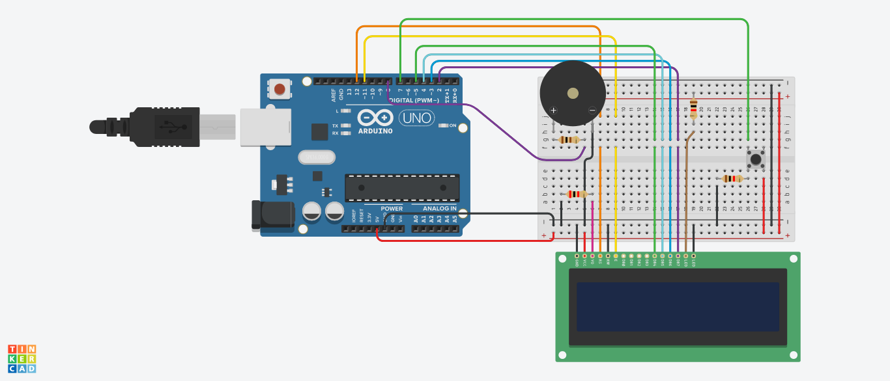

# ArduDino
Classic Dino Runner written for Arduino UNO
 

 
## Components
- Arduino UNO
- LCD1602a
- Buzzer
- Push Button
- Resistor 100 Ohm
- 2 Resistors 1 KOhm
- Resistor 2 KOhm
- Bunch of jumper cables

## Assembly

You may also use <h3>assembly.brd</h3> file to look at assembly closer. Play with resistors for your case of screen brightness and buzzer sound.
 
And ofc upload sketch_ardudino on your board!
 
Press "reset" button on Arduino to null the highscore. 